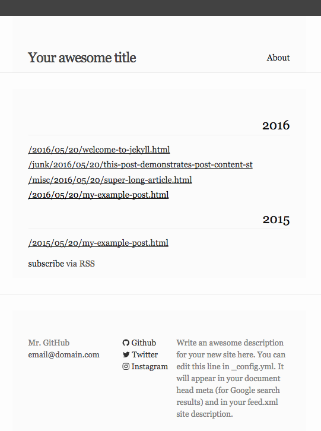
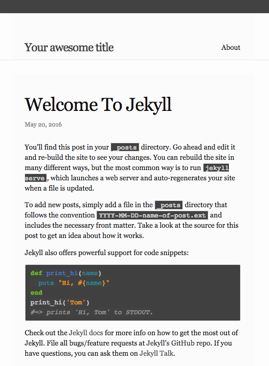

Based on https://github.com/jekyll/minima

# jekyll-flat

<p align="center">
  
  
</p>

## Installation

Add this line to your Jekyll site's Gemfile:

```ruby
gem "jekyll-flat"
```

And add this line to your Jekyll site:

```yaml
theme: jekyll-flat
```

And then execute:

    $ bundle
    
Then add a `css/main.scss` file based on the following template, don't forget to include the frontmatter:

```css
---
---

@import "flat";
```

You can choose to override the [`_includes/head.html `](_includes/head.html) file to specify a custom style path.

## Enabling comments (via Disqus)

Optionally, if you have a Disqus account, you can tell Jekyll to use it to show a comments section below each post.

To enable it, add the following lines to your Jekyll site:

```yaml
  disqus:
    shortname: my_disqus_shortname
```

You can find out more about Disqus' shortnames [here](https://help.disqus.com/customer/portal/articles/466208).

Comments are enabled by default and will only appear in production, i.e., `JEKYLL_ENV=production`

If you don't want to display comments for a particular post you can disable them by adding `comments: false` to that post's YAML Front Matter.

## Enabling Google Analytics

To enable Google Anaytics, add the following lines to your Jekyll site:

```yaml
  google_analytics: UA-NNNNNNNN-N
```

Google Analytics will only appear in production, i.e., `JEKYLL_ENV=production`

## Development

To set up your environment to develop this theme, run `bundle install`.

To test your theme, run `bundle exec rake preview` and open your browser at `http://localhost:4000/flat`. This starts a Jekyll server using your theme and the contents of the `example/` directory. As you make modifications to your theme and to the example site, your site will regenerate and you should see the changes in the browser after a refresh.

## License

The theme is available as open source under the terms of the [MIT License](http://opensource.org/licenses/MIT).
